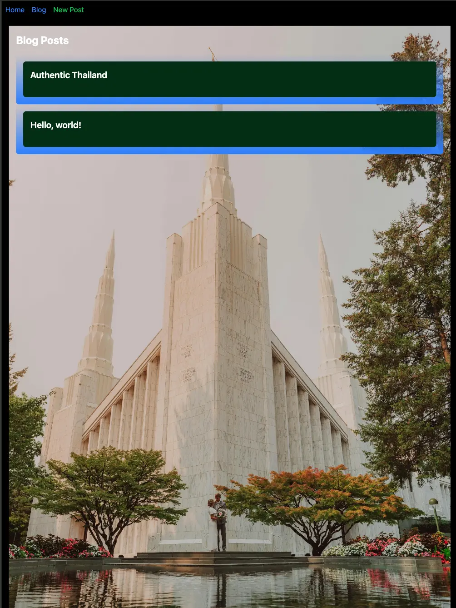
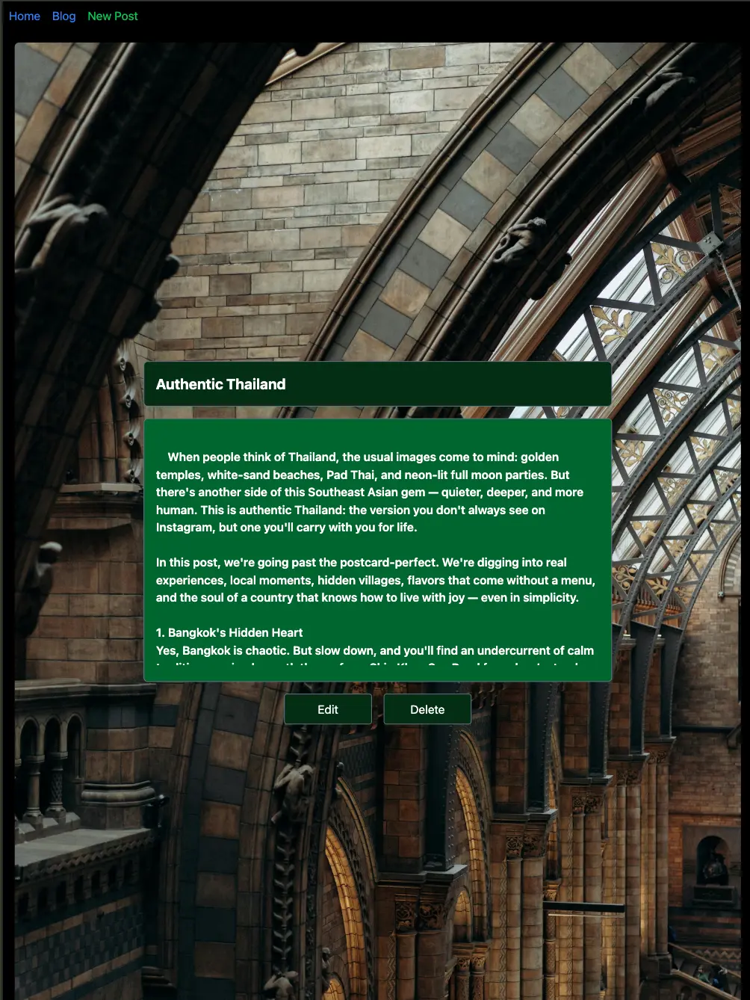
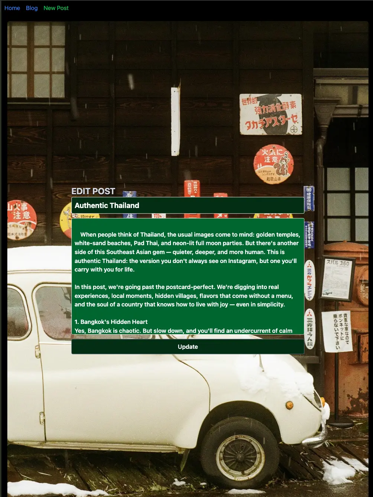
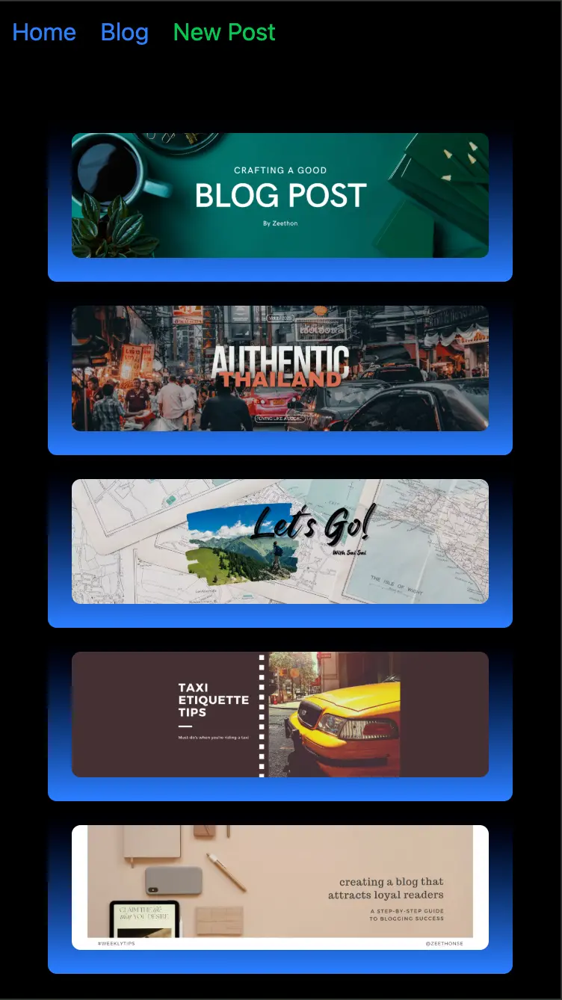
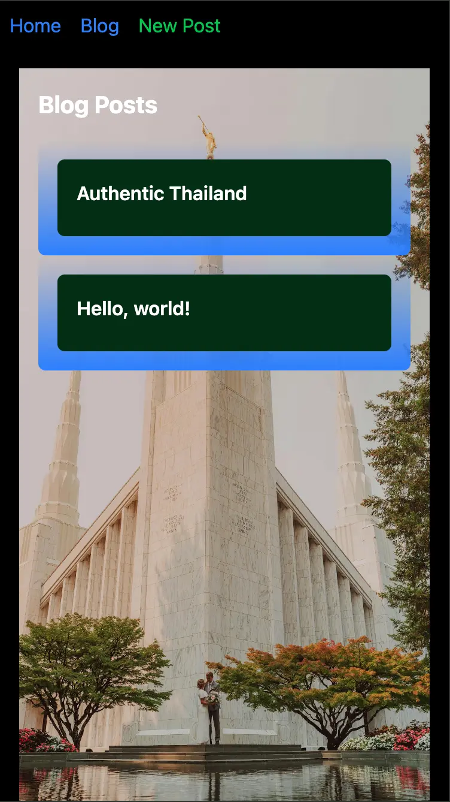
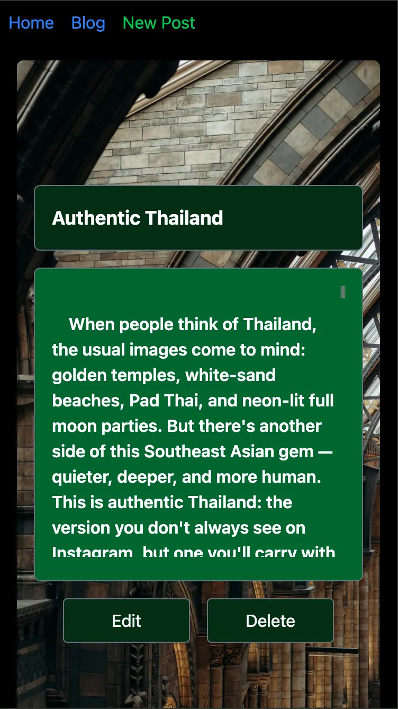
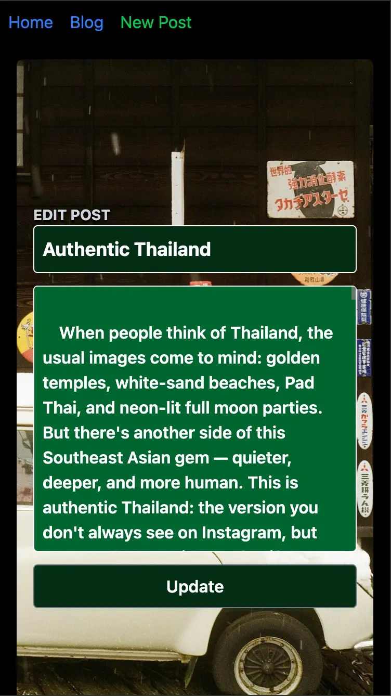
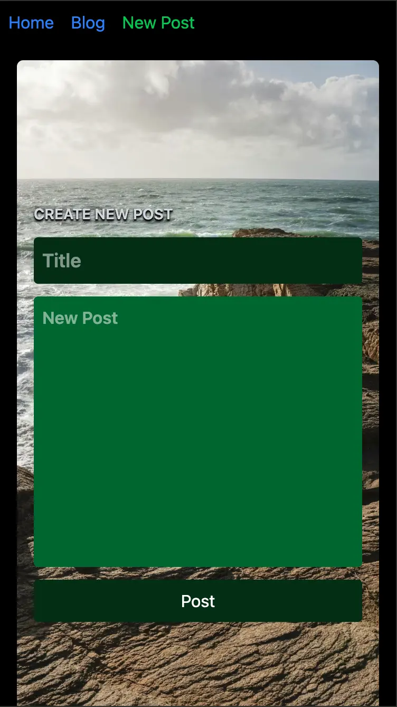

## My Blog - Fullstack Project

This is a fullstack Blog Application built with React.js (Vite) for the frontend and Node.js (Express.js) for the backend.

The application allows users to view, create, edit, and delete blog posts through a simple and clean UI.


# ✨ Features

View list of blog posts

View single blog post details

Create new blog posts

Edit existing blog posts

Delete blog posts

Frontend-backend communication via REST API

Environment-based API URL configuration

Deployed live on the internet!


## 🛠 Tech Stack

# Frontend

Vite

React.js

Tailwind CSS

Axios

React Router DOM

# Backend

Node.js

Express.js

CORS

JavaScript (ES6+)


# 🖥 Project Structure

.
├── backend/    # Node.js Express API Server
├── frontend/   # React.js Vite Client App
├── README.md   # Root project documentation (this file)


# 📸 Screenshots




















# 🚀 Live Demo

Frontend (Vercel): https://frontend-iota-sable.vercel.app

Backend (Render or Hosting Service): https://my-blog-backend-2.onrender.com


# 📦 Local Installation & Running

Follow these steps to run both backend and frontend locally:

1. Clone the Project
```bash
git clone https://github.com/zeethonSE/my-blog.git
cd my-blog
```
2. Backend Setup
```bash
cd backend
npm install
node index.js
```
Backend server will start at http://localhost:5000


3. Frontend Setup
```bash
cd frontend
npm install
npm run dev
```
Frontend app will start at http://localhost:5173

Make sure the backend is running before starting the frontend!


# 🌐 API Endpoints (Backend)

Method | Endpoint | Description

GET | /posts | Retrieve all blog posts

GET | /posts/:id | Retrieve a single post by ID

POST | /posts/new-post | Create a new blog post

PUT | /posts/:id | Update an existing post

DELETE | /posts/:id | Delete a blog post


# 🔧 Environment Variables

Frontend

Create a .env file inside frontend/:
```bash
VITE_API_URL=https://my-blog-backend-2.onrender.com
```
Backend

Create a .env file inside backend/ (optional):
```bash
PORT=5000
```


# ✅ Future Improvements

Add database support (MongoDB/PostgreSQL)

Implement user authentication (Login/Register)

Improve form validations

Better error handling on server side

Improve UI/UX with new features like categories or tags


### 🎉 Thank You for Checking Out My Project!

Feel free to clone, use, or improve this project!


# 🙋‍♂️ Author

Sai Sai

💼 Web Developer

📧 zeethon0@gmail.com

🔗 [LinkedIn](https://linkedin.com/in/ssaiwd25)

# 📄 License

This project is open source and available under the [MIT License.](MIT-LICENSE)

