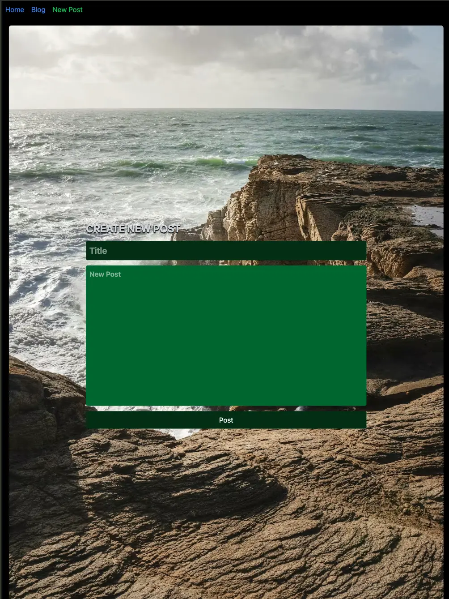

# My Blog

A simple and responsive blog platform built with a Vite + React frontend and a Node.js backend API. This project allows users to view posts with titles, descriptions, and content.

## 🔧 Tech Stack

- Frontend:
  - React.js (Vite)
  - HTML5, CSS3, JavaScript

- Backend:
  - Node.js
  - Express (if you're using it)

- Database (Optional):
  - (MongoDB, PostgreSQL, JSON file, etc. — mention if used)

## 🚀 Live Demo

Frontend: [View Frontend App](https://frontend-iota-sable.vercel.app)  
Backend API: [View API](https://my-blog-backend-2.onrender.com)

## 📸 Screenshots





## ✨ Features

- Fetch and display blog posts from a backend API
- Responsive UI design
- API error handling (optional)
- Dynamic routing on frontend (React Router if used)

## 🛠 How to Run Locally

```bash
# Clone the frontend
git clone https://github.com/zeethonSE/my-blog.git
cd frontend-folder
npm install
npm run dev

# Clone the backend (if separate)
cd backend-folder
npm install
npm run start
```

🙋‍♂️ Author
Sai Sai
💼 Web Developer
📧 zeethon0@gmail.com
🔗 [LinkedIn](https://linkedin.com/in/ssaiwd25)

📄 License
This project is open source and available under the [MIT License.](MIT-LICENSE)

